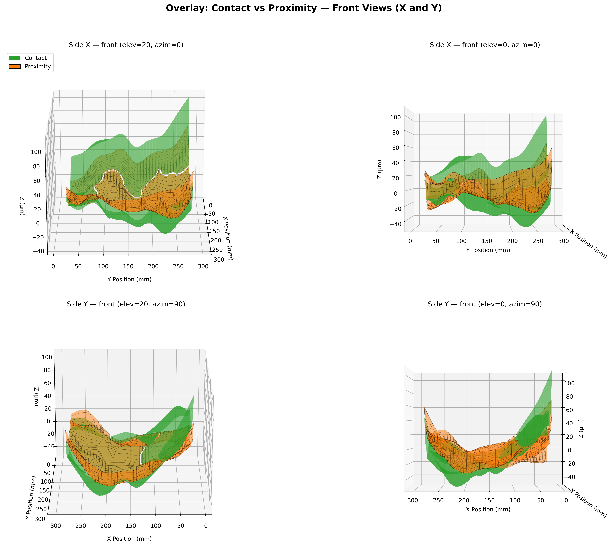
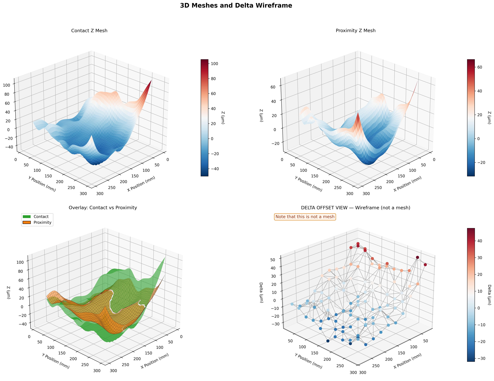
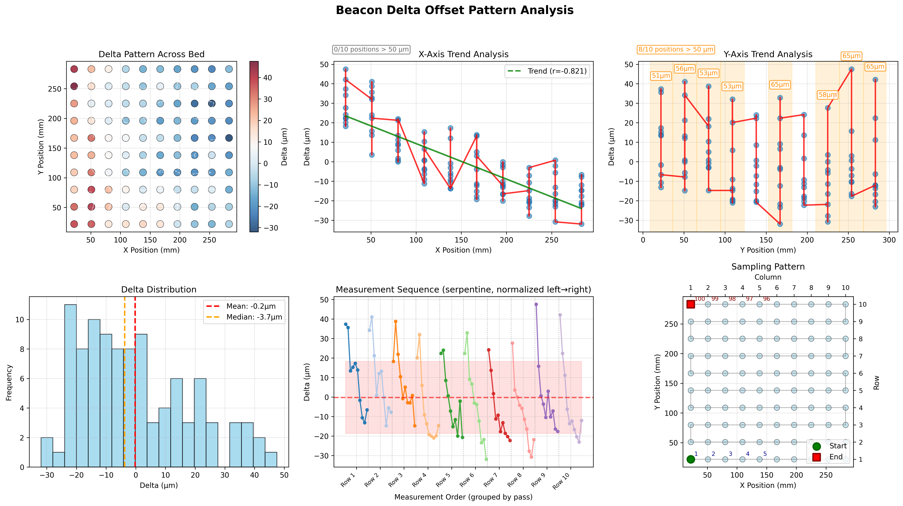
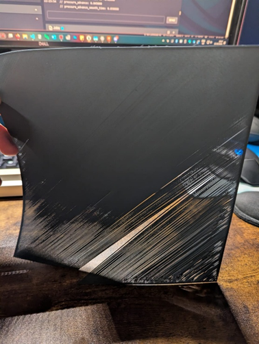
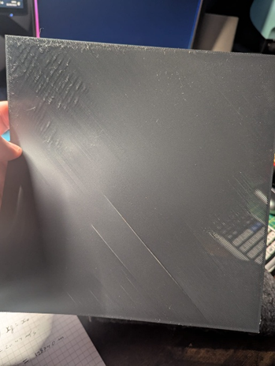
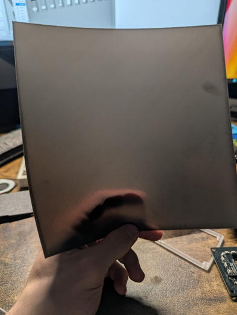

# Gio's Gantry Twist Utility

Klipper module to visualize and adjust gantry twist for printers running the Beacon Eddy Current Surface Scanner

## Overview

This module has 2 modes: analysis and compensation.

Analysis mode samples the bed and generates 3 dashboards with various graphs to help diagnose gantry alignment issues by visualizing the Z-offset measurements from Beacon's contact and proximity modes. It leverages the `BEACON_OFFSET_COMPARE` command to calculate deltas across your print bed.

Ideally, the delta between contact and proximity measurements should be zero (or at least consistent) across the bed. Variations indicate that the Beacon probe and nozzle are operating on different planes, leading to probing inaccuracies and first-layer issues.

Compensation mode works out and applies the Z compensation values for Klipper's native gantry twist compensation module `[axis_twist_compensation]`.

### Requirements

- Klipper
- Beacon probe
- SSH access to your printer
- A printer with internet access (only if using the recommended installation script below)

### Compatibility

This module can work with any printer running Klipper but was designed and tested on a QIDI Plus 4. As such, the installation guide and the default settings are tailored for it. If you install/run on a different printer, please review the installation and settings carefully.

## Installation

Access your printer via SSH and run:

```bash
cd /home/mks && wget -O - https://raw.githubusercontent.com/omgitsgio/gios_gantry_twist_analysis/db2e6d78321c007cf96c7c5a9f77947abbc07494/install.sh | bash
```

Add the configuration below to your `printer.cfg` **before** the `SAVE_CONFIG` section, then restart Klipper.

```cfg
[gantry_twist_analysis]

# Operation mode (0 = analysis, 1 = compensation):
# mode: 0

# Mesh boundaries to probe. When in compensation mode, X values will be used for start_x and end_x.
# min_x: 22.0
# max_x: 283.0
# min_y: 22.0
# max_y: 283.0
# calibrate_y: 152.5

# Points per axis (grid_size * grid_size total).
# When in compensation mode, this will be the sample size along X-axis.
# grid_size: 10

# Test temps
# bed_temp: 0.0
# hotend_temp: 0.0
```
## Usage

Just send to your console:

```
GANTRY_TWIST_UTILITY
```

If no settings are declared, it will run with the config above by default (hence in analysis mode).

You can specify some arguments from console which will override the config file:
```
MODE, BED_TEMP, HOTEND_TEMP, GRID_SIZE, MAX_RETRIES, CALIBRATE_Y
```

### Compensation Mode

To automatically calculate and apply axis twist compensation values:

```
GANTRY_TWIST_UTILITY MODE=compensation
```

This will:
1. Sample along the X-axis at the center Y position as per config
2. Calculate compensation values
3. Update your `[axis_twist_compensation]` configuration
4. Prompt you to run `SAVE_CONFIG` to persist the changes

### Analysis Mode

This mode will probe the bed as per settings/arguments and run 3 dashboards to help visualize the offset data.

Please note that this is all experimental and it's not an exact science, but it has helped me understand that in my case axis twist compensation would have been sufficient to obtain decent results.


### Output Interpretation

The analysis generates three visualization images that help you understand your gantry's twist characteristics:

### 1. `beacon_offset_analysis_3d_meshes_overlay`
Shows overlaid contact and proximity meshes from four different angles, helping you visualize the difference between the nozzle and probe perspectives.



### 2. `beacon_offset_analysis_3d_meshes&offset`
Displays:
- Two separate mesh graphs (contact and proximity)
- An overlay view at 45° angle
- A 3D visualization of the deltas (bottom right)



### 3. `beacon_offset_analysis`
The top-left plot immediately reveals patterns in the extent of the delta values, making it easy to identify bias and twist characteristics.

The X and Y Trend Analysis plots on the right display delta values along their respective axes. The script highlights statistically significant trends and ranges exceeding 50µm. In the example below, note the clear sloping trend on the X-axis and the wide ranges on the Y-axis. While this indicates aggressive gantry twist, the consistent, symmetrical X-axis pattern is ideal for Klipper's X-axis compensation.

The bottom graph in the middle groups the measurements by row or column (depending on the sampling direction) and can help confirm offset patterns.



## Understanding Gantry Twist Impact on First Layer

Gantry twist directly affects first-layer quality by creating inconsistent Z-offsets across the bed. The following are good examples of some patterns that may occur:

### X-Axis Twist Pattern
When your gantry exhibits twist along the X-axis, you'll see variation in the offset deltas as you move left-to-right across the bed. This is the most common twist pattern on CoreXY printers.



### XY Combined Twist Pattern
More complex twist patterns can occur across both X and Y axes, creating diagonal or corner-biased variations that are harder to compensate for mechanically. Generally speaking, you can reduce or remove the effect of one of the axis twists by choosing a beacon/probe mount with zero X or Y offset.



### X-Axis Twist with Compensation
When gantry twist compensation is applied, the first layer becomes more consistent, but the underlying mechanical issue remains.



## Current Status & Future Plans

### Stability
The script is reliable with default settings or minor variations of them. However, it hasn't been extensively stress-tested with edge cases and misuse, so be careful if you change the defaults.

### Future Improvements
The analysis part is very rudimentary. Suggestions are greatly appreciated.
Potential improvements include:
- Enhanced console output with twist detection alerts
- Automated analysis of twist patterns and severity
- Improved graph layouts and visual storytelling
- Additional visualization types for clearer data interpretation

## Credits
A lot of the problem-solving was possible by taking inspiration from <https://github.com/Frix-x/klippain-shaketune>.

The install script was mostly a readaptation of <https://github.com/qidi-community/ShakeTune-For-Plus4/blob/cd94df7b4b2ac4f6a56c27dfaf9f40dbff463335/install.sh>.

## Support
Please refer to the QIDI community on GitHub: <https://github.com/qidi-community> or join the Discord channel: <https://discord.gg/FtDkxKsX>. Feel free to also contact me on GitHub.
